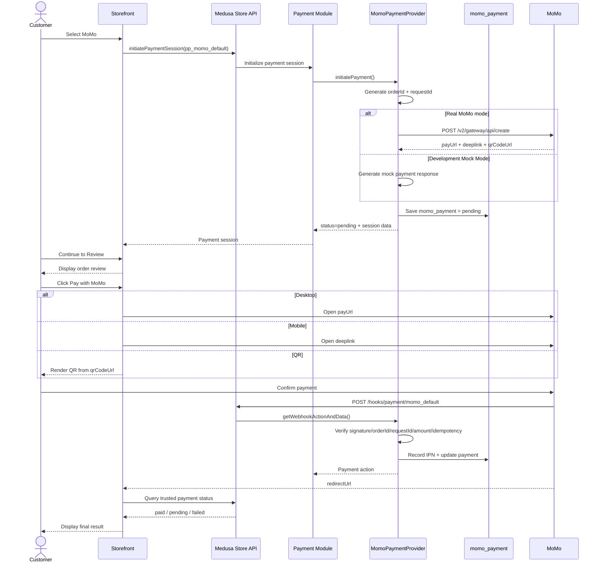

# MoMo Capture Wallet Flow Plan

Updated: 2026-09-15

Official API: https://developers.momo.vn/v3/vi/docs/payment/api/wallet/onetime/

## 1. Goal

Implement MoMo Wallet one-time payment for MedusaJS using:

```text
Thanh Toán Ví MoMo
→ Thanh Toán Thông Thường
→ requestType = captureWallet
→ POST /v2/gateway/api/create
```

Execution modes:

```text
Development
├── Real credentials available → Real MoMo
└── Credentials unavailable → Automatic Mock MoMo

Production
└── Real credentials REQUIRED → Never auto-fallback to mock
```

> Browser redirect is UX only. Payment success must be confirmed server-side through MoMo IPN or transaction-status reconciliation.

## 2. Current Problem

Current UX mixes payment-method selection and payment execution:

```text
Select MoMo
→ initiatePaymentSession()
→ create MoMo payment
→ immediately show Amount / MoMo order / Request / Gateway / Open payment
```

`momo_order_id`, `request_id`, and gateway/debug messages are useful for correlation, logging and reconciliation, but should not be primary customer-facing checkout information.

## 3. Target Checkout UX

```text
Checkout
→ Select MoMo
→ Create/update Medusa payment session
→ Backend creates MoMo payment request
→ Store payUrl / deeplink / qrCodeUrl
→ Continue to Review
→ Review Order
→ Customer clicks "Pay with MoMo"
→ Redirect/deeplink/QR
→ Customer pays
→ MoMo IPN
→ Backend verifies
→ Medusa payment updated
→ Storefront queries trusted state
→ Success / Pending / Failed
```

Selecting MoMo does **not** mean payment has happened.

## 4. API Contract

Create payment:

```http
POST /v2/gateway/api/create
```

Use `requestType = captureWallet`.

Important request fields include `partnerCode`, `storeId`, `requestId`, `amount`, `orderId`, `orderInfo`, `redirectUrl`, `ipnUrl`, `requestType`, `extraData`, `autoCapture`, `lang`, and `signature`.

Important response fields include `orderId`, `requestId`, `amount`, `resultCode`, `message`, `payUrl`, `deeplink`, `qrCodeUrl`, `deeplinkMiniApp`, `responseTime`, and `signature`.

`qrCodeUrl` is QR content, not a QR image URL. If storefront displays QR directly, generate/render a QR image from that value.

## 5. Payment Session Data

`MomoPaymentProviderService.initiatePayment()` should return data needed for subsequent payment UX:

```ts
{
  pay_url,
  deeplink,
  qr_code_url,
  momo_order_id,
  request_id,
  expires_at
}
```

Keep internal IDs for correlation, but do not normally display `momo_order_id`, `request_id`, or gateway debug messages to customers.

## 6. Correct Medusa Checkout Flow



## 7. Review Page

Payment selection:

```text
● MoMo
  Pay securely using MoMo

[ Continue to review ]
```

Review:

```text
Order Summary

Products        290,000 VND
Shipping         60,000 VND
-------------------------
Total            350,000 VND

Payment method
MoMo

[ Pay 350,000 VND with MoMo ]
```

The final payment button performs MoMo navigation.

## 8. Navigation Strategy

Desktop: use `payUrl` as the primary hosted-payment flow.

Mobile: use `deeplink` where appropriate, with `payUrl` as fallback.

QR: optionally render QR from `qrCodeUrl`.

Do not show three confusing payment buttons by default; choose one primary UX based on platform.

## 9. Redirect Flow

Incorrect:

```text
MoMo redirect → Payment Successful
```

Correct:

```text
MoMo redirect
→ /payment-return/momo
→ "Confirming your payment..."
→ query backend trusted state
├── paid → Success
├── pending → Poll/reconcile
└── failed → Failure/retry
```

Do not trust browser redirect query parameters as authoritative payment state.

## 10. IPN Flow

```text
MoMo
→ POST /hooks/payment/momo_default
→ getWebhookActionAndData()
→ verify signature
→ identify momo_payment
→ verify partnerCode/orderId/requestId/amount
→ check transaction identity
→ idempotency
→ record webhook event
→ update momo_payment
→ return Medusa payment action
```

Successful auto-captured payment:

```text
resultCode = 0
→ ledger = paid
→ Medusa action = captured
```

## 11. State Mapping

| MoMo result | Ledger | Medusa action | Behavior |
|---|---|---|---|
| `resultCode = 0` | `paid` | `captured` | Payment successful |
| `resultCode = 9000` | `authorized` | `authorized` | Relevant if `autoCapture=false` |
| Pending | `pending` | `not_supported` | Reconcile later |
| Failure | `failed` | `failed` | Do not mark paid |
| Cancel | `canceled` | `failed` | Customer can retry |
| Invalid signature | event `failed` | reject | Never trust payload |
| Amount/request mismatch | `manual_review` | `not_supported` | Manual investigation |
| Duplicate IPN | duplicate | `not_supported` | No second capture |

## 12. Idempotency

Use persistent database state and constraints around:

```text
request_id
momo_order_id
trans_id
payment_session_id
```

Duplicate IPN must never produce a second capture. Do not use in-memory state for payment idempotency.

## 13. Development Mode Strategy

Previous behavior required:

```bash
MOMO_MOCK_ENABLED=true
```

New behavior:

```text
NODE_ENV != production
AND real credentials missing
→ Automatically enable Mock MoMo
```

Therefore local development does not require explicitly setting `MOMO_MOCK_ENABLED=true`.

## 14. Environment Resolution

```text
Application starts
        ↓
NODE_ENV == production?
├── YES
│   → Require real credentials
│   → Missing credentials = FAIL FAST
│   → Never mock
└── NO
    → MOMO_MOCK_ENABLED explicitly set?
       ├── true → Mock
       ├── false + credentials → Real
       └── unset
           ├── credentials available → Real
           └── credentials missing → Auto Mock
```

Conceptual logic:

```ts
const isProduction = process.env.NODE_ENV === "production"

const hasRealCredentials =
  Boolean(process.env.MOMO_PARTNER_CODE) &&
  Boolean(process.env.MOMO_ACCESS_KEY) &&
  Boolean(process.env.MOMO_SECRET_KEY)

let mockEnabled: boolean

if (isProduction) {
  mockEnabled = false
  if (!hasRealCredentials) {
    throw new Error("MoMo production credentials are required in production")
  }
} else if (process.env.MOMO_MOCK_ENABLED !== undefined) {
  mockEnabled = process.env.MOMO_MOCK_ENABLED.toLowerCase() === "true"
} else {
  mockEnabled = !hasRealCredentials
}
```

## 15. Local Development

Minimal local `.env`:

```bash
NODE_ENV=development
MOMO_REDIRECT_URL=http://localhost:8000/api/payment-return/momo
MOMO_IPN_URL=http://localhost:9001/hooks/payment/momo_default
MOMO_AUTO_CAPTURE=true
MOMO_LANG=vi
MOMO_ORDER_EXPIRE_MINUTES=15
```

Expected:

```text
NODE_ENV=development
credentials missing
MOMO_MOCK_ENABLED unset
→ Mock automatically enabled
```

Developers may still explicitly set `MOMO_MOCK_ENABLED=true` for deterministic tests, demos, frontend work, or CI.

## 16. Real Sandbox

```bash
NODE_ENV=development
MOMO_MOCK_ENABLED=false

MOMO_PARTNER_CODE=<sandbox-partner-code>
MOMO_ACCESS_KEY=<sandbox-access-key>
MOMO_SECRET_KEY=<sandbox-secret-key>

MOMO_REDIRECT_URL=https://<public-storefront>/api/payment-return/momo
MOMO_IPN_URL=https://<public-backend>/hooks/payment/momo_default

MOMO_AUTO_CAPTURE=true
MOMO_LANG=vi
```

IPN backend must be publicly reachable as required by the sandbox environment.

## 17. Production Safety

Production must never silently fall back to mock.

```text
NODE_ENV=production
→ validate credentials
→ missing configuration
→ application startup fails
```

Recommended:

```bash
NODE_ENV=production
MOMO_MOCK_ENABLED=false
MOMO_PARTNER_CODE=<production-secret>
MOMO_ACCESS_KEY=<production-secret>
MOMO_SECRET_KEY=<production-secret>
MOMO_REDIRECT_URL=https://shop.example.com/payment-return/momo
MOMO_IPN_URL=https://api.example.com/hooks/payment/momo_default
```

Secrets must come from deployment secret management, not source control.

## 18. Mock Payment Flow

Mock only the external MoMo boundary:

```text
Select MoMo
→ initiatePayment()
→ mock creates orderId/requestId/payUrl/deeplink/qrCodeUrl
→ momo_payment=pending
→ Continue Review
→ Pay with MoMo
→ Mock payment page
→ Simulate Success / Failure / Cancel
→ generate MoMo-like IPN
→ normal webhook handler
→ normal idempotency/payment processing
→ Medusa updated
```

Avoid mocking the entire business flow.

## 19. Mock Payment Page

Development-only simulator:

```text
-----------------------------------
        MoMo Sandbox Simulator
-----------------------------------

Order: MM...
Amount: 350,000 VND

[ Simulate Success ]
[ Simulate Failure ]
[ Simulate Cancel ]

-----------------------------------
DEV / MOCK ONLY
-----------------------------------
```

Simulation should exercise the same internal IPN processing path used by real MoMo.

## 20. Storefront Changes

Current:

```text
MoMo
Amount
MoMo order
Request
Gateway
Expires
Open MoMo payment
```

Target:

```text
● MoMo
  Pay securely using MoMo
```

Then Review:

```text
Payment Method: MoMo
Total: 350,000 VND

[ Pay with MoMo ]
```

The final button should find the active MoMo payment session, read payment navigation data, choose the appropriate strategy, navigate to MoMo/mock page, and **never mark payment successful locally**.

## 21. Payment Return Page

Implement/verify `/api/payment-return/momo` or equivalent:

```text
Return from MoMo
→ use redirect data only for correlation
→ DO NOT mark success
→ request trusted backend state
→ briefly poll if pending
├── paid → Success
├── failed → Failure
└── still pending → Pending page
```

## 22. Reconciliation

```text
momo_payment=pending
→ older than threshold
→ reconciliation job
→ MoMo transaction-status API
→ verify response
→ update ledger
→ update Medusa
```

Mock mode should optionally simulate missing IPN followed by reconciliation.

## 23. Required Code Changes

Backend types:
- Ensure `captureWallet`.
- Support `payUrl`, `deeplink`, `qrCodeUrl`, `deeplinkMiniApp`, signature and required IPN fields.

MoMo client:
- `createPayment()`
- `queryPayment()`
- `refundPayment()`
- `verifySignature()`
- Production real-only; development supports explicit/automatic mock.

Provider:
- Generate `orderId` and `requestId`.
- Create payment.
- Persist pending ledger.
- Return payment-session data.
- Do not capture in `initiatePayment()`.

Webhook:
- Keep `POST /hooks/payment/momo_default`.
- Verify signature, merchant/payment identity, amount and duplicates.
- Persist event and update ledger before returning the correct Medusa action.

Ledger should persist at least:
- `payment_session_id`
- `momo_order_id`
- `request_id`
- `trans_id`
- `amount`
- `currency_code`
- `status`
- `result_code`
- `pay_url`
- `deeplink`
- `qr_code_url`
- `expires_at`
- `paid_at`
- audit timestamps

Storefront:
- Remove unnecessary debug metadata from customer payment card.
- Move real MoMo navigation to Review/final payment button.
- Add/verify return page, status query/polling, success/pending/failure states.

## 24. Test Plan

Unit:
- `captureWallet` request.
- Create/IPN signatures.
- Invalid signature rejection.
- Mock response shape.
- Production fails on missing credentials.
- Development auto-mocks when credentials are absent.
- Explicit mock override.
- Real mode when credentials exist.

Storefront:
- Selecting MoMo does not mark success.
- Debug IDs are hidden.
- Review shows MoMo.
- Final button navigates correctly.
- Redirect return does not trust browser result.

Integration:
- `pp_momo_default` available.
- Selection creates pending ledger.
- Success IPN updates ledger and Medusa.
- Duplicate IPN cannot double-capture.
- Wrong amount/request → manual review.
- Invalid signature does not mutate payment.
- Failure/cancel remains unpaid.
- Missing IPN can be reconciled.
- Refund uses original transaction identity where required.

Mock E2E:

```text
Checkout
→ Select MoMo
→ Review
→ Pay with MoMo
→ Mock page
→ Simulate Success
→ IPN path
→ Medusa update
→ Return page
→ Success
```

Also test failure, cancel, duplicate IPN, delayed IPN and missing IPN.

## 25. Implementation Order

1. Verify current `captureWallet` client/types.
2. Finalize environment mode resolution.
3. Add production fail-fast credential validation.
4. Make mock client mirror real create-payment response.
5. Verify pending ledger persistence.
6. Remove debug metadata from customer-facing payment UI.
7. Keep payment-session initialization on MoMo selection.
8. Move payment navigation to final Review button.
9. Implement desktop `payUrl`.
10. Implement mobile deeplink/fallback.
11. Add optional QR rendering.
12. Implement/verify payment-return page.
13. Implement trusted payment-status query.
14. Add return-page pending polling.
15. Verify standard IPN route.
16. Verify signature + amount + request/order identity.
17. Verify persistent idempotency.
18. Add mock payment simulator.
19. Make simulator exercise normal IPN/payment processing.
20. Verify reconciliation.
21. Verify refund.
22. Add unit tests.
23. Add integration tests.
24. Run mock E2E.
25. Run real sandbox E2E when credentials are available.
26. Update implementation docs.
27. Prepare production security/config checklist.
28. Deploy only after sandbox verification.

## 26. Definition of Done

- [ ] `captureWallet` is used.
- [ ] Selecting MoMo creates/updates payment session.
- [ ] Selecting MoMo does not imply payment success.
- [ ] Customer UI hides unnecessary debug IDs.
- [ ] Review has a clear `Pay with MoMo` action.
- [ ] `payUrl` works.
- [ ] Mobile deeplink safely works/falls back.
- [ ] QR content is rendered correctly if enabled.
- [ ] Redirect page does not trust browser result.
- [ ] IPN is primary server-side confirmation.
- [ ] Signature and payment identity are verified.
- [ ] Duplicate IPN cannot double-capture.
- [ ] Ledger is persistent/auditable.
- [ ] Missing/delayed IPN has reconciliation.
- [ ] Development auto-mocks without credentials.
- [ ] Explicit mock override works.
- [ ] Production never auto-mocks.
- [ ] Production fails fast without credentials.
- [ ] Mock simulator exercises normal internal processing.
- [ ] Unit/integration/mock E2E tests pass.
- [ ] Real sandbox E2E passes before production.
- [ ] Production secrets are not committed.

## 27. Core Architecture Principle

```text
Payment Method Selection
        !=
Payment Execution
        !=
Payment Confirmation
```

For MoMo:

```text
Selection
→ initialize payment session

Execution
→ customer opens MoMo and pays

Confirmation
→ trusted server-side IPN / reconciliation
```

This separation must remain consistent in Mock, Sandbox and Production.
