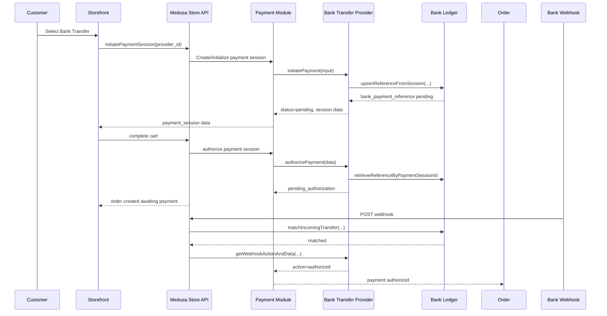
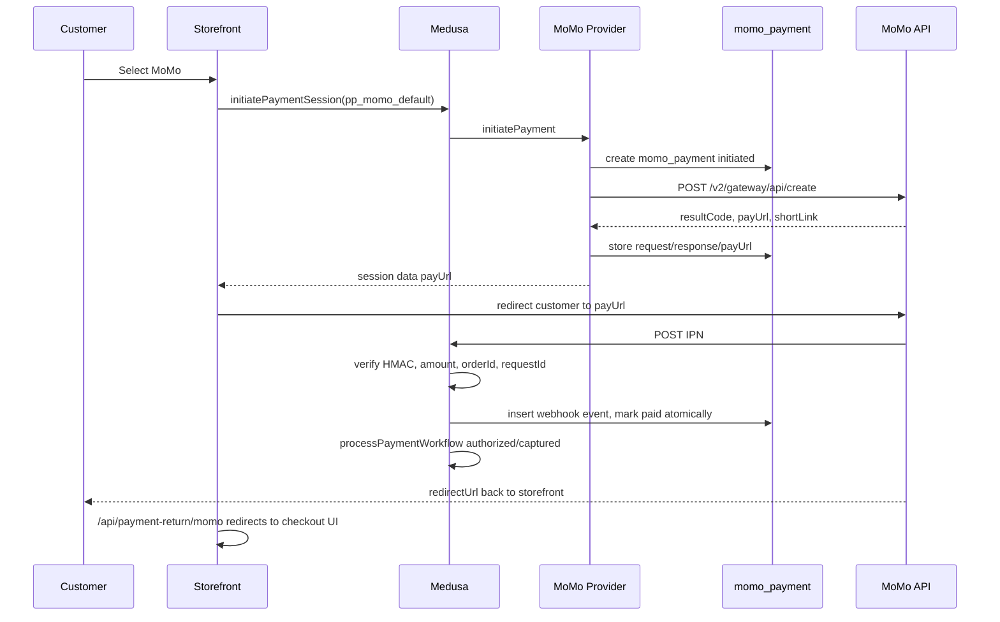
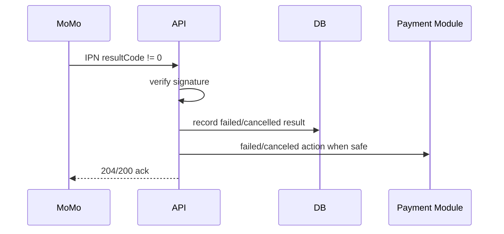
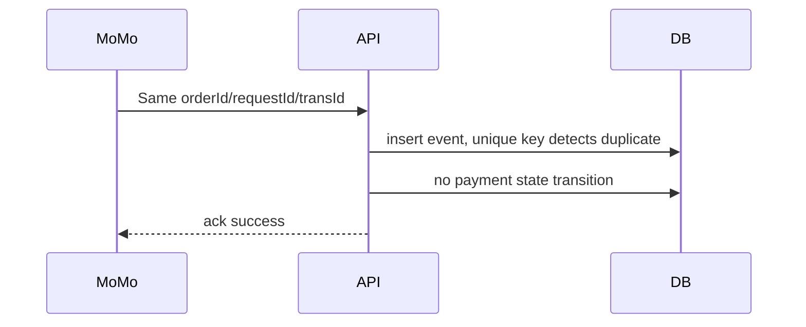
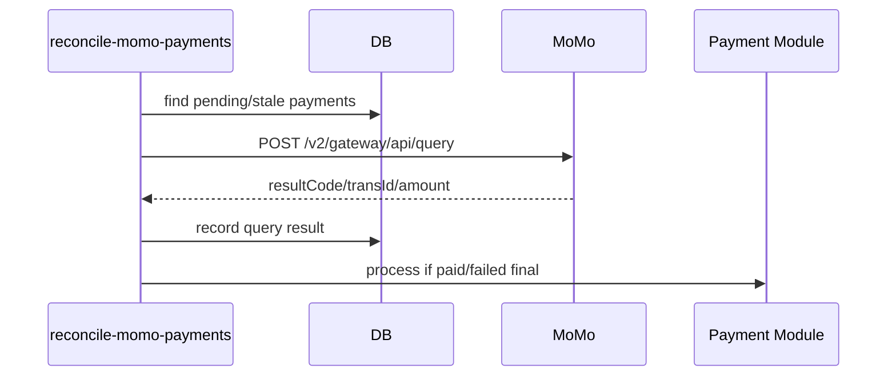
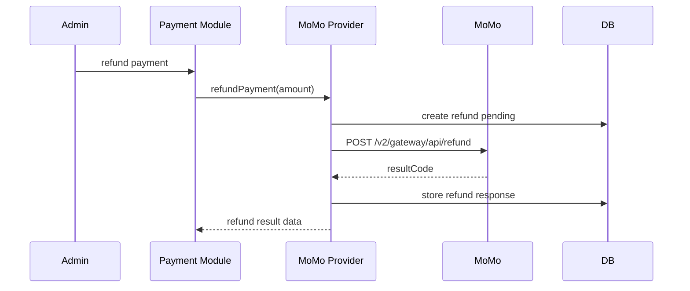

# MoMo Payment Audit and Implementation Plan

Updated: 2026-09-17

## 1. Executive Summary

Repo hiện tại đã có Bank Transfer provider và MoMo provider theo hướng Medusa v2: provider được tách khỏi ledger module, có route webhook chuẩn của Medusa, có expiry/reconciliation job và storefront đã render được Bank Transfer/MoMo trong checkout.

Điểm quan trọng nhất khi vận hành MoMo: không copy Bank Transfer một cách máy móc. Bank Transfer là offline/asynchronous transfer, còn MoMo là payment gateway redirect/QR/deeplink có create-payment API, IPN, query API và refund API. Redirect URL chỉ dùng để đưa khách quay lại storefront, không được xem là source of truth. Source of truth phải là IPN đã verify signature, hoặc transaction query server-side.

Current MoMo implementation snapshot:

- `my-medusa-store/apps/backend/medusa-config.ts` đăng ký `momo-payment` ledger module luôn, nhưng chỉ đăng ký `momo` payment provider khi đủ `MOMO_PARTNER_CODE`, `MOMO_ACCESS_KEY`, `MOMO_SECRET_KEY`, `MOMO_REDIRECT_URL`, `MOMO_IPN_URL`.
- Provider id hiệu lực: `pp_momo_default`.
- Current configured `requestType`: `payWithMethod`. Code type/client vẫn support `captureWallet`, nhưng config đang chạy không dùng `captureWallet` nếu chưa đổi option.
- Không có automatic mock fallback trong config hiện tại.
- IPN chuẩn: `POST /hooks/payment/momo_default`.
- Reconciliation job: `reconcile-momo-payments`, schedule `*/5 * * * *`.
- Storefront có `MomoDetails`, `MomoPaymentButton`, và `/api/payment-return/momo`; return route hiện chỉ redirect UX về checkout theo `resultCode`, chưa query trusted backend state.

Nguồn chính đã đối chiếu:

- Medusa Payment Provider, Payment Session, Checkout Payment Flow, Payment Webhook Events: https://docs.medusajs.com/resources/commerce-modules/payment/payment-provider, https://docs.medusajs.com/resources/commerce-modules/payment/payment-session, https://docs.medusajs.com/resources/commerce-modules/payment/payment-flow, https://docs.medusajs.com/resources/commerce-modules/payment/webhook-events
- MoMo official docs: Wallet One-time Payment `captureWallet`, Payment Notification, Query Transaction, Refund, Result Codes, Digital Signature: https://developers.momo.vn/v3/vi/docs/payment/api/wallet/onetime/, https://developers.momo.vn/v3/docs/payment/api/result-handling/notification/, https://developers.momo.vn/v3/vi/docs/payment/api/payment-api/query/, https://developers.momo.vn/v3/docs/payment/api/payment-api/refund/, https://developers.momo.vn/v3/docs/payment/api/result-handling/resultcode/, https://developers.momo.vn/v3/docs/payment/api/other/signature/

## 2. Current Project Discovery

Backend config:

- `my-medusa-store/apps/backend/medusa-config.ts`
- Registers `bank-transfer-payment` module.
- Registers `momo-payment` module.
- Registers `@medusajs/medusa/payment` with provider `./src/modules/bank-transfer`, id `default`.
- Registers `./src/modules/momo`, id `default`, only when required MoMo env vars are present.
- Effective provider id: `pp_bank-transfer_default`.
- Effective MoMo provider id: `pp_momo_default`.
- Bank options come from `BANK_TRANSFER_*`.
- MoMo options come from `MOMO_*`.

Bank Transfer provider:

- `src/modules/bank-transfer/index.ts`: exports `ModuleProvider(Modules.PAYMENT, { services: [...] })`.
- `src/modules/bank-transfer/service.ts`: extends `AbstractPaymentProvider`.
- `src/modules/bank-transfer/types.ts`: provider/session/webhook types.

Ledger:

- `src/modules/bank-transfer-payment/index.ts`
- `src/modules/bank-transfer-payment/service.ts`
- `src/modules/bank-transfer-payment/models/*`
- `src/modules/bank-transfer-payment/migrations/Migration20260910111430.ts`

Webhook:

- Standard Medusa endpoint from provider id: `POST /hooks/payment/bank-transfer_default`.

Storefront:

- `src/lib/data/payment.ts`: calls `GET /store/payment-providers?region_id=...`.
- `src/lib/data/cart.ts`: calls `sdk.store.payment.initiatePaymentSession(...)` and `sdk.store.cart.complete(...)`.
- `src/modules/checkout/components/payment/index.tsx`: renders payment method and bank details.
- `src/modules/checkout/components/payment-button/index.tsx`: completes cart for bank transfer.

Background jobs:

- `src/jobs/expire-bank-transfer-payments.ts`: runs every 5 minutes and expires pending references.
- `src/jobs/reconcile-momo-payments.ts`: runs every 5 minutes, queries MoMo for pending/authorized payments, and repairs Medusa payment state when MoMo reports success.

## 3. Reconstructed Bank Transfer Flow

Main sequence:

Important method behavior from real code:

- `initiatePayment`: requires `session_id`, generates `PAY XXXXX`, creates/updates ledger reference, returns `status: "pending"`.
- `authorizePayment`: if ledger reference is `matched`, returns `authorized`; otherwise returns `pending_authorization`.
- `capturePayment`: does not call an external bank API; only stamps `captured_at`.
- `refundPayment`: marks `manual_required`, no real bank refund.
- `cancelPayment` / `deletePayment`: only stamps data; ledger status is not updated.
- `updatePayment`: updates ledger amount/currency only if reference is still pending.
- `getPaymentStatus`: maps `matched` to `authorized`, otherwise `pending_authorization`.
- `getWebhookActionAndData`: verifies optional secret, matches ledger, returns Medusa `authorized` on successful match.

Webhook handling:

- Standard `/hooks/payment/bank-transfer_default` delegates to `getWebhookActionAndData` and returns one Medusa action.
- The old custom bank webhook route has been removed. External systems should use only Medusa's standard payment webhook path.

## 4. Current Implementation Audit

`GOOD` - Provider and ledger are separated.
Problem -> Payment lifecycle logic is in `bank-transfer`, audit/reconciliation data is in `bank-transfer-payment`.
Why it matters -> This keeps Medusa integration concerns separate from business/audit records.
Current code -> `medusa-config.ts`, `src/modules/bank-transfer/service.ts`, `src/modules/bank-transfer-payment/service.ts`.
Recommended fix -> Preserve this pattern for MoMo, but use a MoMo-specific ledger rather than reusing bank tables.

`HIGH` - Ledger idempotency is not fully transactional.
Problem -> `matchIncomingTransfer` creates webhook event, checks duplicate transaction, inserts transaction, updates reference in separate operations.
Why it matters -> Concurrent duplicate IPNs can race between duplicate check and insert/update.
Current code -> `src/modules/bank-transfer-payment/service.ts`.
Recommended fix -> For production gateways, enforce unique constraints and process inside a DB transaction or workflow step; handle unique-violation as duplicate.

`GOOD` - Custom bank webhook route removed.
Problem -> The previous custom route duplicated Medusa webhook handling and compared the shared secret directly.
Why it matters -> One webhook path is easier to secure, document, and operate.
Current code -> Bank webhook handling now lives in provider `getWebhookActionAndData()`.
Recommended fix -> Keep using `POST /hooks/payment/bank-transfer_default`; for real bank integrations, replace shared-secret auth with provider-specific HMAC/signature verification.

`MEDIUM` - Live-looking secrets exist in `.env.template`.
Problem -> Template includes concrete JWT, cookie, database, and S3/R2-looking values.
Why it matters -> Templates are often committed and copied; secret-looking values normalize unsafe deployment practice.
Current code -> `my-medusa-store/apps/backend/.env.template`.
Recommended fix -> Replace with placeholders and rotate any exposed real credentials.

`MEDIUM` - `matched_transaction_id` is indexed but not unique.
Problem -> One external transaction should not be able to match multiple references.
Why it matters -> Unique transaction constraint exists on `bank_transaction`, but not on the reference pointer.
Current code -> `bank_payment_reference.matched_transaction_id`.
Recommended fix -> Add a partial unique index where `matched_transaction_id IS NOT NULL AND deleted_at IS NULL`.

`MEDIUM` - Expiration can race with webhook.
Problem -> Job expires pending references while a webhook could be matching the same reference.
Why it matters -> Late but valid payment may be marked `expired` or ignored inconsistently.
Current code -> `expirePendingReferences` and `matchIncomingTransfer`.
Recommended fix -> Use conditional updates (`WHERE status='pending'`) in a transaction, and define late-payment policy.

`MEDIUM` - Storefront payment button may use the wrong session.
Problem -> Review button uses `payment_sessions?.[0]`; payment step uses active pending/pending_authorization session.
Why it matters -> Multiple payment sessions are supported by Medusa, so branch selection can be wrong.
Current code -> `src/modules/checkout/components/payment-button/index.tsx`.
Recommended fix -> Select the same active session logic across components.

`LOW` - Failure event in standard webhook bypasses ledger.
Problem -> `bank_transfer.failed` with `session_id` returns `failed` without recording transaction/event.
Why it matters -> Audit trail misses gateway failure events.
Current code -> `getWebhookActionAndData`.
Recommended fix -> Record every gateway event before returning action.

## 5. MoMo API Contract

Terminology: cụm “MoMo Banking” không phải tên API chính thức trong phần docs đã kiểm tra. Với ecommerce checkout hiện tại, lựa chọn ban đầu là MoMo Wallet one-time payment. Tuy nhiên code mới nhất đang cấu hình `requestType: "payWithMethod"` trong `medusa-config.ts`. Nếu muốn ép đúng flow `captureWallet`, cần đổi option provider và test lại create-payment/IPN với sandbox.

Environment:

- Sandbox domain: `https://test-payment.momo.vn`
- Production domain: `https://payment.momo.vn`
- Method: `POST`, content type JSON UTF-8
- Minimum timeout: 30s for most APIs.

Create payment:

- Endpoint: `POST /v2/gateway/api/create`
- Important request fields: `partnerCode`, `storeId`, `requestId`, `amount`, `orderId`, `orderInfo`, `redirectUrl`, `ipnUrl`, `requestType`, `extraData`, `items`, `userInfo`, `autoCapture`, `lang`, `signature`.
- Current config uses `requestType = "payWithMethod"`. `captureWallet` vẫn được type hỗ trợ và có thể bật bằng config nếu business chọn flow ví one-time payment thuần.
- Signature raw string:
  `accessKey=$accessKey&amount=$amount&extraData=$extraData&ipnUrl=$ipnUrl&orderId=$orderId&orderInfo=$orderInfo&partnerCode=$partnerCode&redirectUrl=$redirectUrl&requestId=$requestId&requestType=$requestType`
- Response fields include `partnerCode`, `requestId`, `orderId`, `amount`, `responseTime`, `message`, `resultCode`, `payUrl`, `shortLink`.

Payment result / IPN:

- MoMo sends payment result to `ipnUrl` server-to-server.
- Result fields include `partnerCode`, `orderId`, `requestId`, `amount`, `orderInfo`, `partnerUserId`, `orderType`, `transId`, `resultCode`, `message`, `payType`, `responseTime`, `extraData`, `signature`.
- IPN signature raw string:
  `accessKey=$accessKey&amount=$amount&extraData=$extraData&message=$message&orderId=$orderId&orderInfo=$orderInfo&orderType=$orderType&partnerCode=$partnerCode&payType=$payType&requestId=$requestId&responseTime=$responseTime&resultCode=$resultCode&transId=$transId`
- Result handling: `resultCode = 0` means succeeded; `9000` means authorized; non-zero means failed, with pending codes such as `1000`, `7000`, `7002`.

Query:

- Endpoint: `POST /v2/gateway/api/query`
- Fields: `partnerCode`, `requestId`, `orderId`, `lang`, `signature`.
- Signature format per docs: `accessKey=$accessKey&orderId=$orderId&partnerCode=$partnerCode`.

Refund:

- Endpoint: `POST /v2/gateway/api/refund`
- Supports full and partial refund.
- Fields: `partnerCode`, refund `orderId`, `requestId`, `amount`, original `transId`, `lang`, `description`, `signature`.
- Signature:
  `accessKey=$accessKey&amount=$amount&description=$description&orderId=$orderId&partnerCode=$partnerCode&requestId=$requestId&transId=$transId`
- Query refund: `POST /v2/gateway/api/refund/query`.

## 6. Proposed MoMo Architecture

Recommended:

- Create `src/modules/momo-payment` ledger module.
- Create `src/modules/momo` payment provider.
- Add small `MomoClient` inside provider/module code for create/query/refund.
- Do not reuse `bank-transfer-payment` tables. Bank transfer references and MoMo gateway orders have different semantics.
- Do not generalize into a shared `payment-ledger` yet. A shared ledger becomes useful after at least two real gateways prove common fields.

Provider id:

- Service identifier: `momo`.
- Config id: `default`.
- Effective provider id: `pp_momo_default`.

Use auto-capture default:

- For ecommerce, prefer `autoCapture: true` unless the business explicitly needs separate authorization/capture. With Medusa's standard webhook path, map IPN `resultCode=0` to `captured` and `resultCode=9000` to `authorized`.
- Use only `POST /hooks/payment/momo_default` for MoMo IPN.
- Do not rely on `MOMO_MOCK_ENABLED`; current provider registration ignores it.

## 7. MoMo Payment Flow

Successful payment:

Failed/cancelled:

Duplicate IPN:

Missing/delayed IPN:

Refund:

## 8. Proposed Data Model

`momo_payment`

- `id` PK, prefix `mopay`
- `payment_session_id` unique
- `cart_id` nullable indexed
- `order_id` nullable indexed
- `provider_id`
- `momo_order_id` unique
- `request_id` unique
- `amount` integer
- `currency_code` text, require `vnd`
- `status` enum: `initiated`, `pending`, `authorized`, `paid`, `failed`, `canceled`, `expired`, `refunded`, `partially_refunded`, `manual_review`
- `result_code` int nullable
- `message` text nullable
- `trans_id` text nullable unique partial
- `pay_type` text nullable
- `pay_url`, `short_link`, `deeplink`, `qr_code_url` nullable
- `raw_create_request`, `raw_create_response` jsonb nullable
- `created_at`, `updated_at`, `paid_at`, `expires_at`, `last_queried_at`

`momo_webhook_event`

- `id` PK, prefix `mowevt`
- `momo_payment_id` indexed nullable
- `event_key` unique, derived from `partnerCode/orderId/requestId/transId/resultCode/responseTime`
- `order_id`, `request_id`, `trans_id` indexed
- `result_code`
- `signature_valid` boolean
- `processing_status` enum: `received`, `processed`, `duplicate`, `ignored`, `failed`
- `raw_payload` jsonb
- `error_message` text nullable
- `received_at`, `processed_at`

`momo_refund`

- `id` PK, prefix `moref`
- `momo_payment_id` indexed
- `payment_id` nullable
- `refund_order_id` unique
- `request_id` unique
- `amount`
- `status` enum: `pending`, `succeeded`, `failed`, `manual_review`
- `result_code`, `message`, `refund_trans_id`
- `raw_request`, `raw_response`
- `created_at`, `updated_at`, `processed_at`

Race condition controls:

- Unique `payment_session_id`, `momo_order_id`, `request_id`, and partial unique `trans_id`.
- Process IPN in one DB transaction.
- Update payment state with conditional status transitions.
- Treat unique violation on webhook/refund as idempotent duplicate.

## 9. Provider Method Design

- `initiatePayment`: validate VND and amount limits, generate `momo_order_id` and `request_id`, create ledger row, call `/v2/gateway/api/create`, store response, return `status: "pending"` and public data (`payUrl`, `shortLink`, expiry, order id).
- `updatePayment`: if session is not paid/final, create a new MoMo order or expire old one when amount/currency changes. Never mutate an already paid order.
- `authorizePayment`: query local ledger; return `authorized` only for `authorized`/`paid`, otherwise `pending_authorization` or error for final failure.
- `capturePayment`: if `autoCapture=true`, do not call MoMo; stamp capture metadata after paid IPN. If `autoCapture=false`, design capture/cancel only after confirming MoMo supports the chosen method.
- `cancelPayment`: mark local MoMo payment canceled if not final; optionally call MoMo cancel API only if selected product supports it.
- `refundPayment`: call `/v2/gateway/api/refund` with original `transId`; persist request/response; support partial refund.
- `retrievePayment`: return local ledger plus latest gateway identifiers; optionally query MoMo only from reconciliation/admin action.
- `deletePayment`: soft-cancel only if not final; do not delete audit rows.
- `getPaymentStatus`: map local status to Medusa status.
- `getWebhookActionAndData`: verify IPN signature and fields, persist event, return `authorized`, `captured`, `failed`, or `not_supported`.

## 10. IPN Design

Critical rules:

- Receive raw body and parsed JSON.
- Validate required fields.
- Verify HMAC SHA256 signature before trusting `resultCode`.
- Compare signature with timing-safe equality.
- Verify `partnerCode`, `orderId`, `requestId`, `amount`, `currency`, and payment status against DB.
- Insert webhook event before state transition.
- Use DB constraints for idempotency.
- Return acknowledgement even for duplicate valid IPN.
- Invalid signature should be recorded with minimal data and rejected.

Edge handling:

- Same `transId` twice: duplicate, no workflow.
- Same `orderId` different `transId`: manual review unless previous attempt failed and new request id/order id policy allows retry.
- Invalid amount: manual review and do not update Medusa.
- Unknown order: record event, return not supported/failure acknowledgement based on MoMo contract.
- Already completed: duplicate/ignored.
- Backend crash after DB update before Medusa workflow: reconciliation job must find `paid` ledger with Medusa not captured and repair.

## 11. Reconciliation

Job: `reconcile-momo-payments`

- Schedule: every 5 minutes.
- Query candidates: `initiated`/`pending` payments older than 2 minutes and not final; `paid` ledger rows whose Medusa payment is not authorized/captured; refund rows pending longer than 2 minutes.
- Backoff: store `query_count`, `last_queried_at`, `next_query_at`; use exponential backoff up to 30 minutes.
- Max retry: for payment status, retry for 24 hours or until MoMo order expiry plus grace period; then mark `manual_review`.
- Do not spam MoMo: batch with a limit, e.g. 50 per run.
- Metrics: reconciliation count, success, failure, backlog age.

## 12. Testing Matrix

| ID | Scenario | Setup | Steps | Expected HTTP | Expected Medusa | Expected DB | Expected MoMo | Logs |
|---|---|---|---|---|---|---|---|---|
| MOMO-T01 | Successful payment | Sandbox credentials | Checkout -> payUrl -> pay | 2xx IPN | Order paid/captured | `paid`, transId set | Success | create/IPN/capture ids |
| MOMO-T02 | User cancel | Sandbox | Open payUrl, cancel | Redirect with failure params | Not paid | `failed`/`canceled` | 1006/1003 | result code |
| MOMO-T03 | Invalid signature | Signed payload altered | POST IPN | 4xx or ignored per route | Unchanged | event `failed`, invalid sig | N/A | invalid sig metric |
| MOMO-T04 | Wrong amount | Alter amount | POST IPN | 200/ignored | Unchanged | `manual_review` | Paid/unknown | amount mismatch |
| MOMO-T05 | Duplicate IPN | Repost same payload | POST twice | 2xx both | Single transition | second duplicate | Same trans | duplicate metric |
| MOMO-T06 | Missing IPN | Block IPN | Run reconcile | 2xx query | Repaired if paid | query event | Success | reconciliation |
| MOMO-T07 | Expired session | Wait expiry | Query/IPN late | 2xx | Manual review | expired/late_paid | Paid/failed | late payment |
| MOMO-T08 | Same order paid twice | Force duplicate order id | Two payments | 2xx/manual | Single paid order | manual_review | Ambiguous | duplicate order |
| MOMO-T09 | Backend crash during IPN | Inject failure after DB update | Retry/reconcile | 2xx after retry | Repaired | paid + workflow pending | Success | recovery |
| MOMO-T10 | Refund success | Paid order | Admin refund | 2xx | Refund recorded | refund succeeded | Refund success | refund ids |
| MOMO-T11 | Refund timeout | Simulate timeout | Retry/query refund | 5xx then query | Eventually consistent | pending/manual | Unknown/success | timeout |

## 13. Security and Observability

DEV ONLY:

- Sandbox credentials.
- Public localhost tunnel for `ipnUrl`.
- Verbose logs with masked payloads.

PRODUCTION REQUIRED:

- HTTPS public backend URL.
- Separate sandbox/prod `partnerCode`, `accessKey`, `secretKey`.
- No secrets in git or `.env.template`.
- HMAC verification for every IPN.
- Timing-safe signature comparison.
- Replay protection with unique event keys/trans ids.
- Rate limiting on custom IPN route.
- DB unique constraints and transactional processing.
- PII masking and raw payload retention policy.
- Credential rotation procedure.
- Alerts on invalid signatures, MoMo API errors, refund failures, stuck pending payments, and reconciliation backlog.

Structured log identifiers:

- `payment_session_id`, `cart_id`, `order_id`, `momo_order_id`, `request_id`, `trans_id`, `webhook_event_id`, `refund_order_id`.

Metrics:

- `momo_payment_created_total`
- `momo_payment_success_total`
- `momo_payment_failed_total`
- `momo_ipn_received_total`
- `momo_ipn_invalid_signature_total`
- `momo_ipn_duplicate_total`
- `momo_reconciliation_total`
- `momo_refund_total`

## 14. Deployment Plan

Pre-deployment:

- Replace `.env.template` secrets with placeholders.
- Add MoMo sandbox/staging/prod env vars.
- Run migrations before enabling provider.
- Verify public `/hooks/payment/momo_default` endpoint over HTTPS.
- Configure MoMo `redirectUrl` and `ipnUrl`.
- Confirm region enables `pp_momo_default` only after backend is ready.

Deployment order:

1. Deploy DB migration.
2. Deploy backend code with provider registered but disabled in production region.
3. Configure MoMo merchant URLs to new backend.
4. Smoke test IPN endpoint and signature validation.
5. Enable `pp_momo_default` for VND region.
6. Deploy storefront UI.
7. Run one low-value production test if allowed by MoMo/business process.
8. Monitor logs, metrics, pending queue, and refund errors.

Rollback:

- Disable provider in region first.
- Keep the standard Medusa webhook endpoint available during rollback grace period for late IPNs.
- Do not drop MoMo tables during rollback.

## 15. Implementation Tasks

| ID | Task | Files | Description | Dependency | Estimate | Test |
|---|---|---|---|---|---:|---|
| MOMO-01 | Research/API contract | docs | Freeze selected MoMo product and fields | None | 4h | Review |
| MOMO-02 | Architecture | docs | Decide provider/module/standard webhook approach | 01 | 3h | Review |
| MOMO-03 | Config | `medusa-config.ts`, `.env.template` | Add MoMo options | 02 | 2h | Boot |
| MOMO-04 | Data model | `src/modules/momo-payment/models/*` | Define payment/event/refund models | 02 | 4h | Typecheck |
| MOMO-05 | Migration | migrations | Create tables/indexes | 04 | 3h | DB migrate |
| MOMO-06 | MoMo API client | `src/modules/momo/client.ts` | Create/query/refund client | 03 | 6h | Unit |
| MOMO-07 | Provider | `src/modules/momo/service.ts` | Provider skeleton | 03,06 | 5h | Unit |
| MOMO-08 | Create payment | provider/client/module | Create payUrl flow | 07 | 6h | Integration |
| MOMO-09 | IPN | provider or route | Receive and process IPN | 08 | 8h | Integration |
| MOMO-10 | Signature | crypto helper | HMAC verify/sign | 06,09 | 4h | Unit vectors |
| MOMO-11 | Idempotency | service/migration | Transactional duplicate handling | 09 | 6h | Race tests |
| MOMO-12 | Medusa processing | route/provider | Authorized/captured workflow | 09 | 5h | E2E |
| MOMO-13 | Query transaction | client/service | `/query` support | 06 | 4h | Unit/integration |
| MOMO-14 | Reconciliation job | `src/jobs/reconcile-momo-payments.ts` | Repair missing IPN/stuck states | 13 | 6h | Job test |
| MOMO-15 | Refund | provider/client/models | Partial/full refund | 06,12 | 7h | Integration |
| MOMO-16 | Storefront | checkout components/constants | MoMo option and payUrl redirect | 08 | 5h | Browser |
| MOMO-17 | Error UX | storefront | Return/cancel/pending screens | 16 | 4h | Browser |
| MOMO-18 | Unit tests | tests | Signing/status/client tests | 06-15 | 6h | Jest |
| MOMO-19 | Integration tests | tests | Provider/IPN/workflow tests | 08-15 | 10h | Jest |
| MOMO-20 | Sandbox E2E | manual docs | Real sandbox checkout/refund | 16-19 | 8h | Sandbox |
| MOMO-21 | Security hardening | route/config | Rate limit, masking, validation | 09-15 | 5h | Security review |
| MOMO-22 | Observability | logging/metrics | Logs, metrics, alerts | 09-15 | 4h | Smoke |
| MOMO-23 | Production config | ops docs | Prod env/URLs checklist | 20 | 3h | Review |
| MOMO-24 | Deployment | scripts/docs | Enable provider and rollout | 23 | 4h | Smoke |
| MOMO-25 | Documentation | `MOMO_PAYMENT_IMPLEMENTATION_GUIDE.md` | Developer guide | All | 6h | Review |

## 16. File-by-File Change Plan

Files to create:

- `my-medusa-store/apps/backend/src/modules/momo/index.ts`: payment module provider export.
- `my-medusa-store/apps/backend/src/modules/momo/service.ts`: `MomoPaymentProviderService`.
- `my-medusa-store/apps/backend/src/modules/momo/types.ts`: options, request/response, session data.
- `my-medusa-store/apps/backend/src/modules/momo/client.ts`: signed MoMo HTTP client.
- `my-medusa-store/apps/backend/src/modules/momo/crypto.ts`: signature helpers.
- `my-medusa-store/apps/backend/src/modules/momo-payment/index.ts`: ledger module.
- `my-medusa-store/apps/backend/src/modules/momo-payment/service.ts`: transactional ledger/IPN/refund logic.
- `my-medusa-store/apps/backend/src/modules/momo-payment/models/*.ts`: payment/event/refund models.
- `my-medusa-store/apps/backend/src/modules/momo-payment/migrations/*.ts`: schema.
- `my-medusa-store/apps/backend/src/jobs/reconcile-momo-payments.ts`: query fallback.
- No custom MoMo webhook route. Use standard `POST /hooks/payment/momo_default`.
- `MOMO_PAYMENT_IMPLEMENTATION_GUIDE.md`: final developer guide after coding.

Files to modify:

- `my-medusa-store/apps/backend/medusa-config.ts`: register module/provider and options.
- `my-medusa-store/apps/backend/.env.template`: add placeholder-only MoMo env vars and remove secret-looking values.
- `my-medusa-store/apps/backend/src/migration-scripts/enable-bank-transfer-provider.ts` or new enable script: enable `pp_momo_default` for VND.
- `my-medusa-store/apps/storefront/src/lib/constants.tsx`: add MoMo display mapping and helper.
- `my-medusa-store/apps/storefront/src/modules/checkout/components/payment/index.tsx`: render MoMo session/payment URL.
- `my-medusa-store/apps/storefront/src/modules/checkout/components/payment-button/index.tsx`: redirect/continue behavior for MoMo.
- `my-medusa-store/apps/storefront/src/app/api/payment-return/route.ts` or new MoMo return route: handle redirect as UX only.

Files to reuse:

- Bank Transfer module as architectural reference.
- Existing checkout provider selection flow.
- Existing Medusa payment workflows and SDK usage.

Files not to modify initially:

- `src/modules/bank-transfer-payment/*`: keep Bank Transfer stable while adding MoMo.
- `src/modules/bank-transfer/*`: only audit/fix separately if requested.
- Existing order/account/product modules: unrelated to payment gateway integration.
