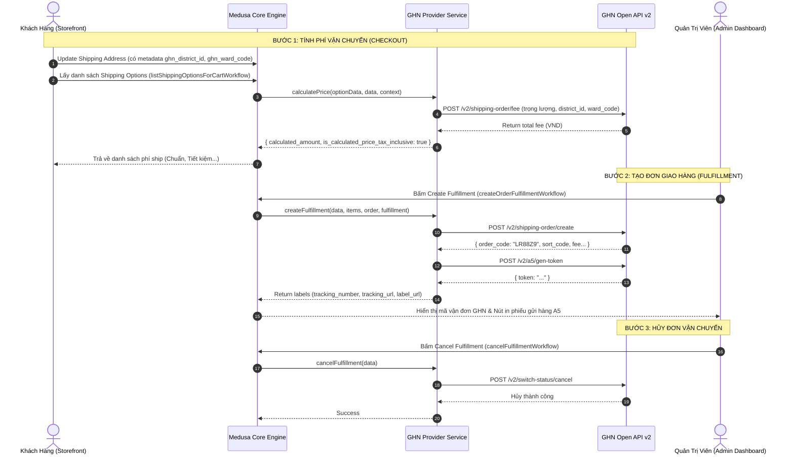

# GHN (Giao Hàng Nhanh) Fulfillment Provider Module Specification

## 1. Mục Đích & Bối Cảnh
Module này cung cấp giải pháp tích hợp trực tiếp giữa **Medusa v2 Fulfillment Engine** và đơn vị vận chuyển **Giao Hàng Nhanh (GHN)** tại Việt Nam.

Nó giải quyết 3 bài toán lớn:
1. **Tính phí ship động (Dynamic Quoting / Real-time Rate)**: Tính toán chính xác cước phí GHN dựa trên địa chỉ người gửi (Stock Location), địa chỉ người nhận (Customer Shipping Address), và tổng trọng lượng hàng trong Cart.
2. **Tự động đẩy đơn vận chuyển (Fulfillment Creation)**: Khi Admin duyệt đơn và bấm *Create Fulfillment*, Medusa tự động gọi GHN API sinh mã vận đơn (`order_code`) và link in phiếu gửi hàng A5/80x80 (`label_url`).
3. **Chuẩn hóa dữ liệu hành chính Việt Nam**: Cầu nối chuyển đổi giữa mô hình địa chỉ quốc tế của Medusa (`city`, `province`) sang chuẩn mã số của GHN (`to_district_id`, `to_ward_code`).

---

## 2. Kiến Trúc Kỹ Thuật (Architecture)

```text
apps/backend/src/modules/giao-hang-nhanh/
├── index.ts        # Module entrypoint đăng ký Provider với Medusa Framework
├── service.ts      # Class GiaoHangNhanhProviderService kế thừa AbstractFulfillmentProviderService
├── client.ts       # HTTP Client wrapper tương tác với GHN REST API v2
├── types.ts        # DTOs, interfaces payload, response và options cấu hình
└── spec.md         # Tài liệu kỹ thuật đặc tả kiến trúc và hợp đồng tích hợp
```

### Định danh Provider:
- `static identifier = "ghn"`
- Provider ID khi lưu vào Medusa DB: `fp_ghn_ghn` hoặc `fp_ghn_default` tùy theo `id` khai báo trong `medusa-config.ts`.

---

## 3. Vòng Đời Tích Hợp (Fulfillment Lifecycle)



---

## 4. Đặc Tả Dữ Liệu Địa Chỉ Hành Chính (Address Mapping Contract)

GHN hiện có **2 cơ chế truyền địa chỉ**:

### 4.1 Định dạng mới (Sau 01/07/2025 — `is_new_to_address: true`)
- **Đặc điểm:** Không cần cung cấp mã quận/huyện (`to_district_id`) hay mã phường/xã (`to_ward_code`). GHN tự động bóc tách từ chuỗi địa chỉ đầy đủ kết hợp với tên phường và tên tỉnh.
- **Các trường gửi lên:**
  - `is_new_to_address`: `true`
  - `to_address`: Chuỗi địa chỉ chi tiết (VD: `"72 Lê Thánh Tôn, Phường Sài Gòn, TP. Hồ Chí Minh"`)
  - `to_ward_name`: Tên phường/xã (VD: `"Phường Sài Gòn"`)
  - `to_province_name`: Tên tỉnh/thành (VD: `"Hồ Chí Minh"`)
- **Ưu điểm lớn:** Storefront Medusa có thể tận dụng trực tiếp các trường địa chỉ tiêu chuẩn (`address_1`, `city`, `province`) mà không bắt buộc phải tích hợp 3 dropdown mã số phức tạp.

#### Ví dụ Curl Tạo Đơn (Định dạng mới — `is_new_to_address: true`):
```bash
curl -X POST https://dev-online-gateway.ghn.vn/shiip/public-api/v2/shipping-order/create \
  -H "Token: 5c1d8a9e-2f4b-11ed-..." \
  -H "ShopId: 92837" \
  -H "Content-Type: application/json" \
  -d '{
    "payment_type_id": 2,
    "required_note": "CHOXEMHANGKHONGTHU",
    "to_name": "Trần Minh Anh",
    "to_phone": "0987654321",
    "to_address": "72 Lê Thánh Tôn, Phường Sài Gòn, TP. Hồ Chí Minh",
    "to_ward_name": "Phường Sài Gòn",
    "to_province_name": "Hồ Chí Minh",
    "is_new_to_address": true,
    "content": "Áo thun unisex GHN - 2 chiếc",
    "weight": 600,
    "length": 25,
    "width": 20,
    "height": 8,
    "service_type_id": 2,
    "items": [
      { "name": "Áo thun GHN size M", "quantity": 2, "weight": 300 }
    ]
  }'
```

---

### 4.2 Định dạng truyền thống (Legacy Format — Bắt buộc mã số)
- **Đặc điểm:** Áp dụng cho các endpoint cũ hoặc khi tạo shop/tạo đơn theo chuẩn truyền thống. Bắt buộc:
  - `to_district_id`: Kiểu số nguyên (Int)
  - `to_ward_code`: Kiểu chuỗi ký tự (String)
- **Quy ước Metadata trong Medusa Storefront:**
  ```json
  {
    "shipping_address": {
      "first_name": "Nguyễn Văn",
      "last_name": "A",
      "phone": "0987654321",
      "address_1": "Số 1, Đường X",
      "city": "Hồ Chí Minh",
      "province": "Quận 1",
      "country_code": "vn",
      "metadata": {
        "ghn_province_id": 202,
        "ghn_district_id": 2009,
        "ghn_ward_code": "00123"
      }
    }
  }
  ```

#### Ví dụ Curl Tạo Đơn (Định dạng truyền thống):
```bash
curl -X POST https://dev-online-gateway.ghn.vn/shiip/public-api/v2/shipping-order/create \
  -H "Token: 5c1d8a9e-2f4b-11ed-..." \
  -H "ShopId: 92837" \
  -H "Content-Type: application/json" \
  -d '{
    "payment_type_id": 2,
    "required_note": "CHOXEMHANGKHONGTHU",
    "to_name": "Nguyen Van A",
    "to_phone": "0909123456",
    "to_address": "Số 1, Đường X",
    "to_province_id": 202,
    "to_district_id": 2009,
    "to_ward_code": "00123",
    "content": "Sản phẩm A",
    "weight": 1000,
    "service_type_id": 2,
    "items": [
      { "name": "Sản phẩm A", "quantity": 1, "weight": 1000 }
    ]
  }'
```

---

### 4.3 Cơ chế Auto-Detect Thông Minh trong `service.ts`

Trong `GiaoHangNhanhProviderService`, hệ thống được thiết kế để **tự động tương thích cả 2 chế độ**:
1. Nếu đơn hàng có `metadata.ghn_district_id` và `metadata.ghn_ward_code` -> Tự động dùng **Định dạng truyền thống**.
2. Nếu không có mã số quận/huyện nhưng có thông tin tỉnh/thành (`shipping_address.province` hoặc `city`) -> Khi tạo đơn vận chuyển (`createFulfillment`), tự động kích hoạt `is_new_to_address: true` với `to_province_name` và `to_ward_name`.
3. Cho phép ép buộc dùng định dạng mới thông qua option `useNewAddressFormat: true` trong `medusa-config.ts`.
4. **Quy tắc tính phí (`calculatePrice`):**
   > [!IMPORTANT]
   > Endpoint tính phí của GHN (`POST /v2/shipping-order/fee`) **bắt buộc** phải có `to_district_id` (Int) và `to_ward_code` (String). Tùy chọn `is_new_to_address: true` hiện tại chỉ mới áp dụng cho endpoint Tạo đơn (`POST /v2/shipping-order/create`).
   > - Khi khách hàng đã chọn xong Tỉnh/Huyện/Xã (hoặc chuyển đổi thành công sang `district_id`): GHN trả về phí chính xác 100%.
   > - Khi khách hàng chưa chọn Quận/Huyện: Hàm `calculatePrice` tự động dùng mức phí fallback (30.000 VNĐ) để tránh nghẽn luồng checkout.

#### Ví dụ Curl Tính Phí Chuẩn (`POST /v2/shipping-order/fee`):
```bash
curl -X POST https://online-gateway.ghn.vn/shiip/public-api/v2/shipping-order/fee \
  -H "Token: YOUR_TOKEN" \
  -H "ShopId: 12345" \
  -H "Content-Type: application/json" \
  -d '{
    "service_id": 53320,
    "from_district_id": 1450,
    "to_district_id": 1444,
    "to_ward_code": "20308",
    "height": 10,
    "length": 20,
    "width": 15,
    "weight": 500,
    "insurance_value": 0,
    "coupon": null
  }'
```

---

### 4.4 Quy Trình Chuyển Đổi Địa Chỉ Mới Sang `to_district_id` / `to_ward_code`

Để giải quyết bài toán tính cước, Storefront và Backend phối hợp theo luồng Master Data chuẩn của GHN:
1. **Lấy danh sách Tỉnh/Thành:** Backend cung cấp endpoint `GET /store/ghn/provinces` (gọi GHN `/master-data/province`).
2. **Lấy danh sách Quận/Huyện:** Khi khách chọn Tỉnh, gọi `GET /store/ghn/districts?province_id=...` (gọi GHN `/master-data/district`).
3. **Lấy danh sách Phường/Xã:** Khi khách chọn Huyện, gọi `GET /store/ghn/wards?district_id=...` (gọi GHN `/master-data/ward`).
4. **Lưu Metadata vào Cart:** Gán `ghn_province_id`, `ghn_district_id`, `ghn_ward_code` vào `cart.shipping_address.metadata`.
5. **Tính phí tự động:** Hàm `calculatePrice` trong Medusa Provider đọc `to_district_id` và `to_ward_code` từ metadata để gọi `/v2/shipping-order/fee` theo thời gian thực.

---

## 5. Đặc Tả Cấu Hình (Configuration Specification)

### 5.1 Biến môi trường (`apps/backend/.env`)
```env
GHN_API_TOKEN=your_ghn_token_here
GHN_SHOP_ID=your_ghn_shop_id_here
GHN_FROM_DISTRICT_ID=1442
GHN_FROM_WARD_CODE=20101
GHN_ENDPOINT=https://dev-online-gateway.ghn.vn/shiip/public-api
GHN_MOCK_ENABLED=false
```

### 5.2 Đăng ký trong `medusa-config.ts`
```typescript
modules: [
  // ... các modules khác
  {
    resolve: "@medusajs/medusa/fulfillment",
    options: {
      providers: [
        {
          resolve: "@medusajs/medusa/fulfillment-manual",
          id: "manual",
        },
        {
          resolve: "./src/modules/giao-hang-nhanh",
          id: "ghn",
          options: {
            token: process.env.GHN_API_TOKEN,
            shopId: Number(process.env.GHN_SHOP_ID),
            fromDistrictId: Number(process.env.GHN_FROM_DISTRICT_ID || 1442),
            fromWardCode: process.env.GHN_FROM_WARD_CODE || "20101",
            endpoint: process.env.GHN_ENDPOINT || "https://dev-online-gateway.ghn.vn/shiip/public-api",
            mockEnabled: process.env.GHN_MOCK_ENABLED === "true",
            requiredNote: "CHOXEMHANGKHONGTHU",
            paymentTypeId: 1, // 1: Shop trả, 2: Khách trả
            defaultWeight: 500, // gram
          },
        },
      ],
    },
  },
]
```

---

## 6. Hướng Dẫn Kích Hoạt Trong Medusa Admin (No-Code Setup)

1. Mở Admin Dashboard tại `http://localhost:9000/app` (hoặc cổng cấu hình).
2. Điều hướng đến **Settings** -> **Locations & Shipping**.
3. Chọn kho hàng xuất hàng (**Stock Location**).
4. Tại tab **Fulfillment Providers**, chọn **Edit** và bật kết nối **GHN (fp_ghn_ghn)**.
5. Tại bảng **Service Zones** (ví dụ: Vietnam):
   - Bấm **Add Shipping Option**.
   - **Title**: "Giao Hàng Nhanh (Tiêu Chuẩn)"
   - **Provider**: Chọn `GHN`
   - **Fulfillment Option**: Chọn `ghn-standard`
   - **Price Type**: Chọn `Calculated` (Hệ thống sẽ tự động gọi hàm `calculatePrice` qua API GHN để hiển thị giá theo đơn).
   - Lưu cấu hình.

---

## 7. Chế Độ Mock (Local Development Mock Mode)

Khi chưa có API Token hoặc Shop ID thật từ GHN:
- Đặt `GHN_MOCK_ENABLED=true` trong file `.env`.
- `GhnClient` sẽ tự động:
  - Sinh cước ship giả lập (25.000đ base + phụ phí cân nặng).
  - Sinh mã vận đơn mock dạng `GHN_MOCK_xxxxxx`.
  - Sinh token in nhãn giả lập.
- Giúp đội ngũ Frontend và QA có thể test trọn vẹn luồng checkout và tạo fulfillment mà không bị gián đoạn.
