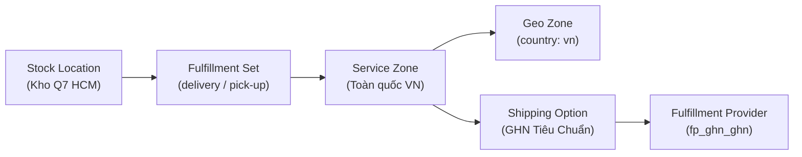

# Phase 1 — Admin Setup: Stock Location, Service Zone, Shipping Option

> **Mục tiêu:** Sau phase này, Admin Dashboard đã có đầy đủ cấu hình để Shipping Option "GHN Tiêu Chuẩn" hiển thị ở Storefront checkout.

---

## 1. Tổng Quan

Phase 1 chủ yếu là **cấu hình qua Admin UI** (no-code). Code backend đã hoàn thành từ commit `be26789`.



---

## 2. Checklist Setup Admin (Step-by-step)

### 2.1 Tạo Stock Location (Kho Hàng)
- **Vào:** Admin → Settings → Locations & Shipping
- **Thao tác:** Add Location
  - Name: `Kho Quận 7 — HCM`
  - Address: `123 Nguyễn Văn Linh, P. Tân Phú, Q.7, TP.HCM`
  - Country: `Vietnam`
- **Quan trọng:** Địa chỉ kho này quyết định `from_district_id` khi tính phí GHN. Nếu có nhiều kho, cần config `fromDistrictId` riêng cho từng location (sẽ xử lý ở Phase nâng cao).

### 2.2 Gắn Fulfillment Provider vào Location
- **Thao tác:** Trong Stock Location vừa tạo → Tab "Fulfillment Providers" → Edit
- **Bật:** `GHN (fp_ghn_ghn)` ✅
- **Giữ:** `Manual (fp_manual_manual)` ✅ (để backup)

### 2.3 Tạo Service Zone
- **Thao tác:** Trong Stock Location → Shipping → Add Service Zone
  - Name: `Vietnam — Toàn quốc`
  - Geo Zone: Country = `vn`
  
### 2.4 Tạo Shipping Option
- **Thao tác:** Trong Service Zone → Add Shipping Option
  - **Title:** `Giao Hàng Nhanh (Tiêu Chuẩn)`
  - **Provider:** `GHN`
  - **Fulfillment Option:** `ghn-standard` (service_type_id: 2)
  - **Price Type:** `Calculated` ← Bắt buộc để kích hoạt `calculatePrice()`
  - **Enabled in Store:** ✅
- **(Tùy chọn) Thêm Shipping Option cho GHN Hỏa Tốc:**
  - Title: `Giao Hàng Nhanh (Hỏa Tốc)`
  - Fulfillment Option: `ghn-express` (service_type_id: 3)
  - Price Type: `Calculated`

---

## 3. Kiểm Tra Kết Quả

Sau khi setup xong, gọi API kiểm tra:

```bash
# Lấy Shipping Options cho 1 Cart
GET http://localhost:9000/store/shipping-options?cart_id=<cart_id>
```

**Kết quả mong đợi:**
```json
{
  "shipping_options": [
    {
      "id": "so_xxx",
      "name": "Giao Hàng Nhanh (Tiêu Chuẩn)",
      "amount": 32500,  // Calculated bởi GHN API (hoặc mock)
      "provider_id": "fp_ghn_ghn",
      "data": {
        "id": "ghn-standard",
        "service_type_id": 2
      }
    }
  ]
}
```

---

## 4. Biến Môi Trường Cần Có (`.env`)

```env
# === GHN Configuration ===
GHN_API_TOKEN=          # Token từ dev.ghn.vn
GHN_SHOP_ID=            # Shop ID từ dev.ghn.vn
GHN_FROM_DISTRICT_ID=1442  # District ID của kho gửi hàng
GHN_FROM_WARD_CODE=20101   # Ward code của kho gửi hàng
GHN_ENDPOINT=https://dev-online-gateway.ghn.vn/shiip/public-api
GHN_MOCK_ENABLED=true      # true = dùng mock, false = gọi GHN thật
```

> [!TIP]
> Trong giai đoạn dev, để `GHN_MOCK_ENABLED=true` (hoặc không cần set Token/ShopId).
> Mock sẽ sinh phí ship giả lập (25.000₫ base + 5.000₫/500g phụ trội).

---

## 5. File Code Liên Quan

| File | Trạng thái | Mô tả |
|---|---|---|
| `medusa-config.ts` L191-L222 | ✅ Đã có | Đăng ký GHN provider |
| `modules/giao-hang-nhanh/index.ts` | ✅ Đã có | Module entrypoint |
| `modules/giao-hang-nhanh/service.ts` | ✅ Đã có | Provider service |
| `modules/giao-hang-nhanh/client.ts` | ✅ Đã có | GHN API client |
| `modules/giao-hang-nhanh/types.ts` | ✅ Đã có | TypeScript types |

> **Kết luận Phase 1:** Không cần viết thêm code. Chỉ cần cấu hình Admin Dashboard đúng trình tự.
