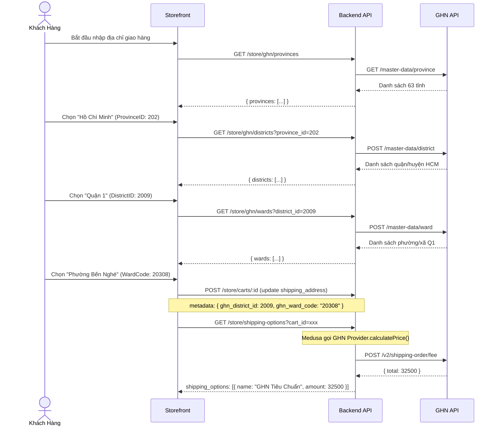

# Phase 2 — API Routes: Master Data Địa Chỉ VN + Tính Phí Ship

> **Mục tiêu:** Tạo 3 API endpoints proxy GHN master data (Tỉnh/Huyện/Xã) + đảm bảo `calculatePrice()` hoạt động đúng.

---

## 1. Vấn Đề Cần Giải Quyết

GHN API tính phí (`/v2/shipping-order/fee`) **bắt buộc** `to_district_id` (Int) và `to_ward_code` (String).

→ Storefront cần cho khách chọn Tỉnh → Huyện → Xã → lưu ID vào `cart.shipping_address.metadata`.

→ Để Storefront không cần biết API Token GHN, ta tạo 3 **proxy routes** trên Backend.

---

## 2. API Endpoints (Mô hình 2 cấp mới — 34 Tỉnh/Thành)

> **Cập nhật:** GHN đã chuyển đổi sang mô hình hành chính 2 cấp (Tỉnh/Thành → Phường/Xã, bỏ cấp Quận/Huyện) theo tài liệu chính thức:
> - Tỉnh/Thành mới: https://developer.ghn.dev/vi/docs/master-data/get-province-new
> - Phường/Xã mới: https://developer.ghn.dev/vi/docs/master-data/get-ward-new

### 2.1 `GET /store/ghn/provinces`
```
Mô tả: Lấy danh sách 34 Tỉnh/Thành phố mới nhất
Proxy:  GHN GET /v3/master-data/province/all

Response:
{
  "code": 200,
  "message": "Success",
  "data": [
    {
      "_id": 1000001,
      "name": "Hồ Chí Minh",
      "extension_names": ["hồ chí minh", "tp.hồ chí minh", "hcm", "ho chi minh"],
      "type": "province",
      "parent_id": 1,
      "status": 1
    },
    ...
  ]
}
```

### 2.2 `GET /store/ghn/wards?province_id=1000001`
```
Mô tả: Lấy danh sách Phường/Xã trực thuộc Tỉnh/Thành (không qua Quận/Huyện)
Proxy:  GHN GET /v3/master-data/ward/all-by-province-id?province_id=1000001

Response:
{
  "code": 200,
  "message": "Success",
  "data": [
    {
      "_id": 1003646,
      "name": "Phường Vũng Tàu",
      "extension_names": ["phường vũng tàu", "p.vũng tàu", "vung tau"],
      "type": "ward",
      "parent_id": 1000001,
      "status": 1
    },
    ...
  ]
}
```

---

## 3. Cấu Trúc File

```
apps/backend/src/api/store/ghn/
├── provinces/
│   └── route.ts          # GET handler
├── districts/
│   └── route.ts          # GET handler (query: province_id)
└── wards/
    └── route.ts          # GET handler (query: district_id)
```

---

## 4. Mẫu Code — `route.ts` (Provinces)

```typescript
import type { MedusaRequest, MedusaResponse } from "@medusajs/framework/http"
import { GhnClient } from "../../../../modules/giao-hang-nhanh/client"

// Singleton cache (TTL 24h vì master data ít thay đổi)
let cachedProvinces: any[] | null = null
let cacheExpiry = 0

export async function GET(req: MedusaRequest, res: MedusaResponse) {
  try {
    const now = Date.now()
    if (cachedProvinces && now < cacheExpiry) {
      return res.json({ provinces: cachedProvinces })
    }

    const client = new GhnClient({
      token: process.env.GHN_API_TOKEN || "",
      shopId: Number(process.env.GHN_SHOP_ID || 0),
      endpoint: process.env.GHN_ENDPOINT,
    })

    const provinces = await client.getProvinces()
    cachedProvinces = provinces
    cacheExpiry = now + 24 * 60 * 60 * 1000 // 24h

    return res.json({ provinces })
  } catch (error: any) {
    return res.status(500).json({ error: error.message })
  }
}
```

> [!NOTE]
> **Cải tiến nên làm:** Sử dụng `ICacheService` (Redis) thay vì in-memory cache.
> GhnClient đã có sẵn trong `modules/giao-hang-nhanh/client.ts`, chỉ cần import.

---

## 5. Caching Strategy

| Data | TTL | Lý do |
|---|---|---|
| Provinces | 24 giờ | Dữ liệu gần như không đổi |
| Districts | 24 giờ | Dữ liệu gần như không đổi |
| Wards | 12 giờ | Đôi khi có cập nhật xã mới |

---

## 6. Flow Tổng Hợp — Storefront Chọn Địa Chỉ → Tính Phí



---

## 7. Middleware Configuration

Cần thêm vào `src/api/middlewares.ts`:

```typescript
// Cho phép store routes truy cập GHN master data
{
  matcher: "/store/ghn/*",
  method: "GET",
  middlewares: [/* không cần auth — data công khai */],
}
```

---

## 8. Acceptance Criteria

- [ ] `GET /store/ghn/provinces` trả về danh sách 63 tỉnh (hoặc mock)
- [ ] `GET /store/ghn/districts?province_id=202` trả về danh sách quận HCM
- [ ] `GET /store/ghn/wards?district_id=2009` trả về danh sách phường Q1
- [ ] Khi cart có `metadata.ghn_district_id` + `ghn_ward_code`, `calculatePrice()` trả phí GHN thật
- [ ] Khi cart không có metadata, `calculatePrice()` trả fallback 30.000₫
