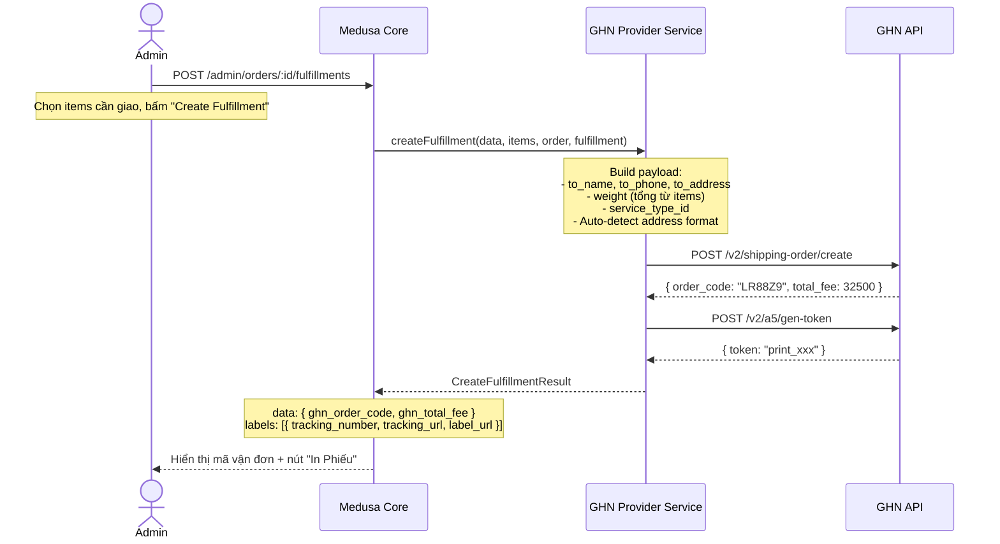
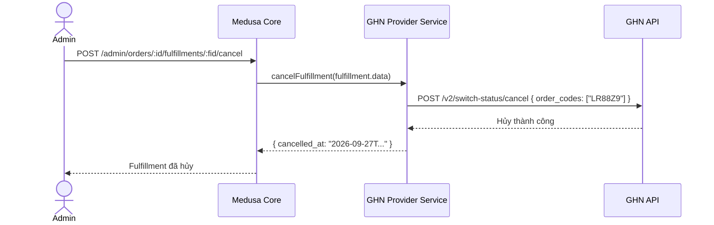

# Phase 4 — Fulfillment: Tạo Vận Đơn, In Phiếu, Hủy Đơn

> **Mục tiêu:** Admin tạo fulfillment từ Order → GHN sinh mã vận đơn → In phiếu A5 → Hủy nếu cần.
> Phase này chủ yếu đã **hoàn thành trong code** (`service.ts`). Spec này document flow và các edge cases.

---

## 1. Flow Tạo Fulfillment



---

## 2. Dữ Liệu Trả Về Sau Khi Tạo Fulfillment

### 2.1 `fulfillment.data` (lưu trong DB)
```json
{
  "service_type_id": 2,
  "ghn_order_code": "LR88Z9",
  "ghn_total_fee": 32500,
  "ghn_sort_code": "220-A-01-B2",
  "ghn_expected_delivery_time": "2026-09-30T18:00:00Z",
  "ghn_trans_type": "truck"
}
```

### 2.2 `fulfillment.labels[]`
```json
[
  {
    "tracking_number": "LR88Z9",
    "tracking_url": "https://donhang.ghn.vn/?order_code=LR88Z9",
    "label_url": "https://dev-online-gateway.ghn.vn/a5/public-api/printA5?token=xxx"
  }
]
```

---

## 3. In Phiếu Giao Hàng (Label Printing)

| Format | URL Pattern | Kích thước |
|---|---|---|
| A5 | `/a5/public-api/printA5?token=xxx` | 148×210mm |
| 80×80 | `/a5/public-api/print80x80?token=xxx` | 80×80mm |
| 52×70 | `/a5/public-api/print52x70?token=xxx` | 52×70mm |

> Admin mở `label_url` trong tab mới → In ra dán lên kiện hàng.

---

## 4. Hủy Fulfillment



> [!WARNING]
> GHN chỉ cho hủy đơn ở trạng thái **chưa lấy hàng**. Nếu shipper đã pick, API sẽ từ chối.

---

## 5. Partial Fulfillment (Giao Từng Phần)

Medusa hỗ trợ giao từng phần:
- Đơn hàng có 5 items, Admin có thể tạo Fulfillment chỉ với 3 items
- Sau đó tạo thêm Fulfillment cho 2 items còn lại
- Mỗi Fulfillment → 1 mã vận đơn GHN riêng biệt

---

## 6. Address Format Auto-Detection

Code hiện tại trong `service.ts` (L230-L233):

```typescript
const useNewFormat = Boolean(
  this.options_.useNewAddressFormat ||
    (!toDistrictId && toProvinceName)
)
```

| Scenario | Format | Payload |
|---|---|---|
| Có `metadata.ghn_district_id` + `ghn_ward_code` | **Legacy** | `to_district_id`, `to_ward_code` |
| Không có ID, chỉ có `province`/`city` text | **New** (`is_new_to_address: true`) | `to_province_name`, `to_ward_name` |
| Config `useNewAddressFormat: true` | **Forced New** | Luôn dùng format mới |

---

## 7. Business Rules: Dynamic service_type_id & Items Payload

### 7.1 Quy tắc xác định service_type_id khi tạo đơn
- **`totalWeight < 20kg`**: Tự động chọn `service_type_id = 2` (Gói Chuẩn / Hàng nhẹ).
- **`totalWeight >= 20kg`**: Tự động chọn `service_type_id = 5` (Hàng nặng).
- Mặc định luôn giả định tuyến đường hỗ trợ 2 type 2 và 5. Nếu tạo đơn với type 5 thất bại (do Shop chưa ký bảng giá), hệ thống tự động retry với type 2.

### 7.2 Cấu trúc items[] khi tạo đơn
Mỗi item trong `items[]` gửi sang GHN tuân thủ DTO:
- `name`: Tên sản phẩm
- `quantity`: Số lượng
- `price`: Đơn giá
- `weight`: Ưu tiên `variant.weight` > `product.weight` > `defaultWeight (500g)`
- `length, width, height`: Ưu tiên `variant.[dim]` > `product.[dim]` > `defaultDimensions (10x10x10cm)`

---

## 8. Code Đã Hoàn Thành

| Method | File | Trạng thái |
|---|---|---|
| `createFulfillment()` | `service.ts` | ✅ Done (Kèm fallback 5 → 2 & full dimensions) |
| `cancelFulfillment()` | `service.ts` | ✅ Done |
| `createReturnFulfillment()` | `service.ts` | ⚠️ Stub (trả về rỗng) |
| `createOrder()` | `client.ts` | ✅ Done |
| `cancelOrder()` | `client.ts` | ✅ Done |
| `getPrintToken()` | `client.ts` | ✅ Done |

---

## 9. Acceptance Criteria

- [ ] Admin tạo fulfillment thành công từ Order detail
- [ ] Mã vận đơn GHN hiển thị trên Admin UI
- [ ] Link "In phiếu A5" hoạt động (mở tab mới hiện phiếu)
- [ ] Tracking URL trỏ đúng đến trang tra cứu GHN
- [ ] Hủy fulfillment hoạt động
- [ ] Partial fulfillment (giao nhiều lần) hoạt động
- [ ] Mock mode tạo đơn mock thành công
- [ ] Tự động fallback giữa service_type_id 5 và 2 nếu shop chưa kích hoạt bảng giá hàng nặng
