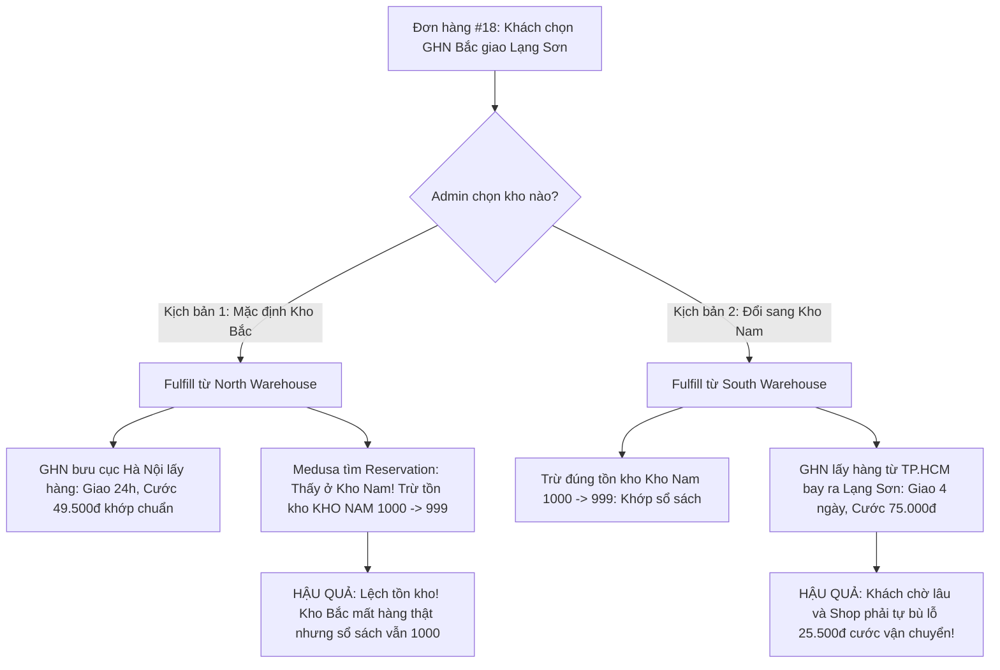
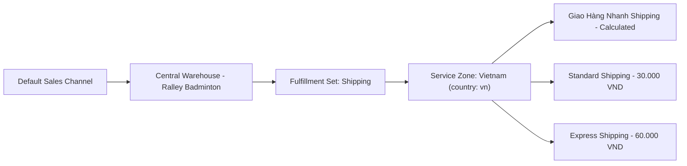

# Báo Cáo Kiến Trúc Fulfillment & Đa Kho (Medusa v2)
## Phân Tích Kỹ Thuật, Đánh Giá Rủi Ro và Quyết Định Quy Về 1 Kho Trung Tâm

> **Ngày lập báo cáo**: Tháng 10/2026  
> **Dự án**: DTC E-Commerce Platform (Medusa v2.21 + Next.js Storefront + GHN Fulfillment)  
> **Tài liệu tham chiếu liên quan**: [Commerce Features Architecture](./commerce-features-architecture.md)

---

## 1. Tóm Tắt Quyết Định Kiến Trúc (Executive Summary)

Sau quá trình thử nghiệm, kiểm thử thực tế trên hệ thống và phân tích sâu mã nguồn Core Medusa v2, nhóm kỹ thuật quyết định:

> **QUY HOẠCH TOÀN BỘ HỆ THỐNG VỀ MÔ HÌNH 1 KHO TRUNG TÂM (SINGLE CENTRAL WAREHOUSE) CHO KÊNH BÁN LẺ ONLINE.**

Quyết định này nhằm:
1. **Triệt tiêu hoàn toàn các lỗi kiến trúc của Medusa v2** (đã được xác nhận trên các GitHub Issues chính thức: **#16115**, **#16135**, **#16338**, **#17032**).
2. **Khắc phục triệt để hiện tượng lệch kho**: Chấm dứt tình trạng hàng bốc ở Kho Bắc nhưng phần mềm lại trừ tồn kho ở Kho Nam.
3. **Làm sạch giao diện Storefront Checkout**: Không còn hiện tượng nhân đôi tùy chọn vận chuyển (Duplicate Shipping Options).
4. **Tránh rủi ro bù lỗ chi phí vận chuyển**: Đảm bảo cước phí khách trả khớp 100% với chi phí đơn vị 3PL (Giao Hàng Nhanh - GHN) thực tế thu.

---

## 2. Các GitHub Issues Cốt Lõi Trên Medusa v2

| Issue ID | Tiêu đề & Link | Bản chất kỹ thuật & Phản hồi từ Medusa Core Team |
| :--- | :--- | :--- |
| **Issue #16115** | [Admin Create Fulfillment breaks when a shipping option's fulfillment set has multiple stock locations](https://github.com/medusajs/medusa/issues/16115) | • **Ràng buộc quan hệ**: Quan hệ giữa `FulfillmentSet` và `StockLocation` là **Many-to-One** (1 Kho có nhiều Fulfillment Set, nhưng 1 Fulfillment Set chỉ thuộc về 1 Kho duy nhất).<br>• **Lỗi phát sinh**: Nếu cố tình link 1 Fulfillment Set chung cho cả 2 kho, trường `.location` sẽ bị array hóa $\to$ Admin Dashboard crash do `.location.id` bị `undefined`.<br>• **Phản hồi chính thức từ Medusa Team**: *"The best way for you to do it right now would be to have different shipping options for each location."* |
| **Issue #16135** | [createOrderFulfillmentWorkflow filter typo in reservation remote query](https://github.com/medusajs/medusa/issues/16135) | • Lỗi truy vấn trong step lấy Reservation khi tạo fulfillment, dẫn đến việc quét toàn bộ bảng reservation thay vì lọc theo item, gây suy giảm hiệu năng khi mở rộng đa kho. |
| **Issue #16338 / #17032** | [Inventory Reservation decoupled from Shipping Method / Multi-warehouse Concurrency](https://github.com/medusajs/medusa/issues/17032) | • **Sự đứt gãy luồng xử lý**: Khi giỏ hàng complete (`completeCartWorkflow`), step `reserveInventoryStep` **hoàn toàn không đọc Shipping Method của giỏ hàng**.<br>• Thuật toán chỉ duyệt `sales_channel.stock_locations` và **luôn bốc kho đầu tiên có đủ hàng** (`location_ids[0]`).<br>• Hệ quả: Khách chọn ship từ Kho Bắc, nhưng hệ thống lại khóa tồn kho ở Kho Nam. |

---

## 3. Phân Tích Thực Tế: Nghiệp Vụ & Kỹ Thuật Va Phải Khi Cố Làm 2 Kho

### 3.1. Case Study Thực Tế: Order #18 (`order_01M3XAKR0HFMR0V2K30DEPR53X`)

Trong quá trình test luồng mua hàng và tạo vận đơn, hệ thống ghi nhận dữ liệu thực tế tại PostgreSQL:

```text
Khách hàng: Nguyễn Hải Linh
Địa chỉ nhận: Phường Đông Kinh, TP. Lạng Sơn (Miền Bắc)
Sản phẩm: 1x Yonex Aerobite (STR-AEROBITE)
Shipping Method khách chọn: "GHN bac" (so_01M3XAH5N17N90GCD2DRK7DM3B) - Cước: 49.500₫
Kho của Shipping Option: North Warehouse (sloc_...C48MZ6)
```

**Tuy nhiên, dữ liệu Reservation Item trong Database lại là:**
```sql
SELECT line_item_id, location_id FROM reservation_item;
-- Kết quả:
-- location_id = 'sloc_01M3VEBRQBNCW4FKJTBPHTK55V' (South Warehouse - Kho Nam!)
```

#### Hai kịch bản "tiến thoái lưỡng nan" khi Admin bấm Create Fulfillment:



---

### 3.2. Lỗi Duplicate Shipping Options trên UI Checkout
* Khi cấu hình cả Kho Bắc và Kho Nam có Service Zone toàn quốc (`country_code: "vn"`):
* Medusa workflow `listShippingOptionsForCartWorkflow` duyệt qua tất cả kho của Sales Channel $\to$ Trả về **$2 \times 3 = 6$ phương thức ship** (2 dòng GHN, 2 dòng Standard, 2 dòng Express).
* Khách hàng bị rối loạn vì không biết phải chọn dòng nào, và khách hàng cũng không có trách nhiệm phải biết đơn hàng nên đi từ kho nào.

---

### 3.3. Lỗi "Giỏ Hàng Hỗn Hợp" (Split Cart Defect)
* Khách mua 2 món: Vợt A (chỉ còn ở Kho Nam) + Túi B (chỉ còn ở Kho Bắc).
* Vì Medusa v2 chưa có tính năng Split Cart tự động:
  * Nếu chọn Kho Nam $\to$ Báo hết hàng Túi B.
  * Nếu chọn Kho Bắc $\to$ Báo hết hàng Vợt A.
* 👉 **Khách hàng hoàn toàn không thể checkout được đơn hàng!**

---

## 4. Giải Pháp Áp Dụng: Quy Về 1 Kho Trung Tâm (Single Central Warehouse)

### 4.1. Kiến Trúc Chuẩn Hóa


### 4.2. Tại Sao Mô Hình Này Tối Ưu Nhất Cho E-Commerce Việt Nam?
1. **GHN đã có hạ tầng logistics 63 tỉnh thành**:
   * Hàng xuất phát từ 1 kho trung tâm (ví dụ TP.HCM hoặc Hà Nội).
   * Khách ở cùng tỉnh/khu vực $\to$ GHN tính cước nội tỉnh ($22.000₫$), giao trong 24h.
   * Khách ở liên miền $\to$ GHN tự tính cước liên miền ($35.000₫ - 55.000₫$), giao trong 2 - 3 ngày.
   * Khách hàng là người trả đúng cước phí thực tế dựa trên địa chỉ của họ.
2. **Khớp dữ liệu 100% (Zero Tech Debt)**:
   * 1 Stock Location $\implies$ `location_ids[0]` của Reservation và `location_id` của Shipping Option luôn luôn là một.
   * Admin bấm Create Fulfillment $\implies$ Tồn kho trừ đúng kho, vận đơn GHN tạo đúng kho, không có cảnh báo vàng hay sai lệch số liệu.
   * Không bao giờ bị duplicate shipping options ở Storefront.
3. **Bảo toàn tính năng nâng cao**:
   * `reservation_item`: Giữ chỗ sản phẩm tức thì khi khách đặt hàng.
   * `incoming_quantity`: Quản lý hàng sắp nhập về khi tồn kho xuống thấp.
   * `cancel_order`: Hủy đơn và tự động hoàn trả tồn kho nếu phát sinh sự cố hư hỏng.

---

## 5. Hướng Dẫn Cấu Hình Kỹ Thuật (Technical Configuration)

### 5.1. File Seed Kho Hàng & Vận Chuyển (`apps/backend/src/migration-scripts/seed/stock-and-shipping.ts`)
* Chỉ định nghĩa **1 Stock Location duy nhất** (Kho Trung Tâm Ralley Badminton):
  ```ts
  const centralWarehouseMeta = {
      company: "Ralley Badminton Store",
      province_id: 1000001, // TP. Hồ Chí Minh (hoặc Hà Nội)
      district_id: 1442,
      ward_code: "20101",
      is_new_address: true,
  };
  ```
* Tạo **1 Fulfillment Set duy nhất** và link 1-1 với Stock Location đó.
* Tạo **1 bộ Shipping Options duy nhất** (`enabled_in_store: true`).

### 5.2. File Seed Tồn Kho (`apps/backend/src/migration-scripts/seed/inventory.ts`)
* Seed toàn bộ tồn kho của tất cả sản phẩm (`stocked_quantity: 1000`) vào duy nhất Location ID của Kho Trung Tâm.

### 5.3. Module Giao Hàng Nhanh (`apps/backend/src/modules/giao-hang-nhanh/service.ts`)
* Bỏ cơ chế Smart Routing đa kho phức tạp.
* GHN Service luôn lấy tọa độ xuất kho cố định từ Kho Trung Tâm (`context.from_location`), kết hợp với địa chỉ nhận hàng của khách để tính cước chính xác qua GHN Order Preview API.

---

## 6. Lộ Trình Mở Rộng: Nếu Tương Lai Bắt Buộc Cần 2+ Kho Thì Làm Gì?

Nếu trong tương lai doanh nghiệp mở rộng quy mô chuỗi bán lẻ vật lý và bắt buộc phải vận hành từ 2 kho trở lên, cần áp dụng một trong các giải pháp chuyên biệt sau:

### Lựa Chọn A: Xây dựng Custom OMS Routing Engine (Khuyên dùng cho Đa Kho Online)
* Giữ 1 Sales Channel chung.
* Không để khách tự chọn kho trên UI (tránh duplicate options). Khách chỉ chọn dịch vụ "Giao Tiêu Chuẩn" hoặc "Giao Hỏa Tốc".
* Viết **Custom Subscriber** lắng nghe sự kiện `order.placed`:
  1. Đọc địa chỉ nhận hàng của đơn hàng.
  2. Kiểm tra tồn kho thực tế của Kho Bắc và Kho Nam.
  3. Quyết định kho tối ưu nhất (kho gần hơn và còn đủ hàng).
  4. Cập nhật `reservation_item.location_id` và gán kho cho đơn hàng trước khi Admin tạo fulfillment.

### Lựa Chọn B: Phân Tách Sales Channel Theo Khu Vực (Mô Hình Chuỗi Bán Lẻ)
* Tạo 2 Sales Channels: `Kênh Miền Bắc` (gắn Kho Bắc) và `Kênh Miền Nam` (gắn Kho Nam).
* Storefront bổ sung tính năng **Khu vực mua hàng** (Store Switcher): Khách vào web chọn khu vực của mình $\to$ Gán cookie/session theo Sales Channel đó.
* Ưu điểm: Độc lập dữ liệu hoàn toàn.
* Nhược điểm: Phải duy trì quản lý sản phẩm trên nhiều kênh và không chia sẻ tồn kho chéo được nếu một kho hết hàng.
